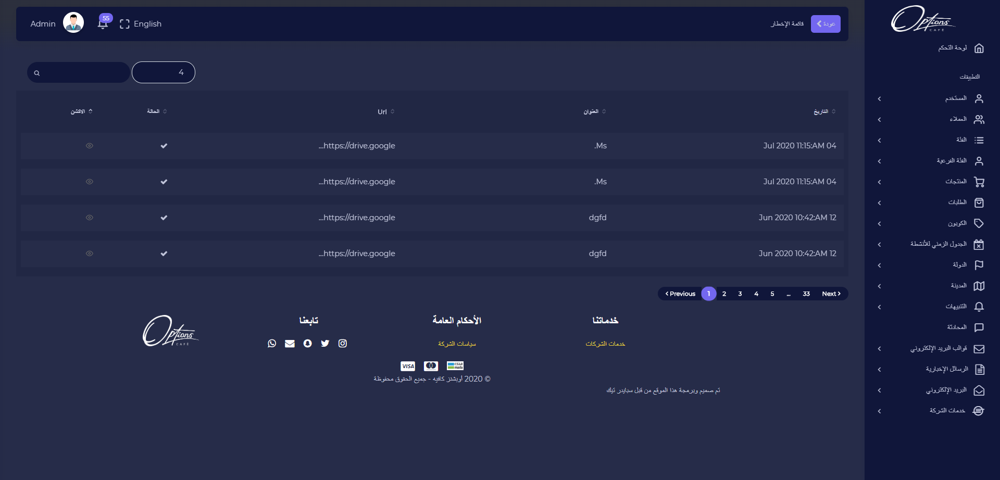

## قائمة التنبيهات

 يتم عرض تاريخ الارسال, العنوان, الرابط, الحالة لكل عنصر من القائمة

---

## ارسال اشعار

لارسال اخطار جديد

| الوصف | الحقل |   # |
| ----- | :---: | --: |
| عنوان التنبيه| العنوان | 1 |
| يتم وضع رابط التنبيه الذي سيفتحه المستخدم | url | 2 |
| محتوى رسالة الاشعار | رسالة | 3 |

:::important
اذا تم ادخال البيانات بشكل صحيح ستظهر رسالة تفيد بذلك

:::

:::caution

اذا كان هناك قيم مفقودة مطلوبة سيتم تنبيه المستخدم بضرورة ادخالها

:::

---