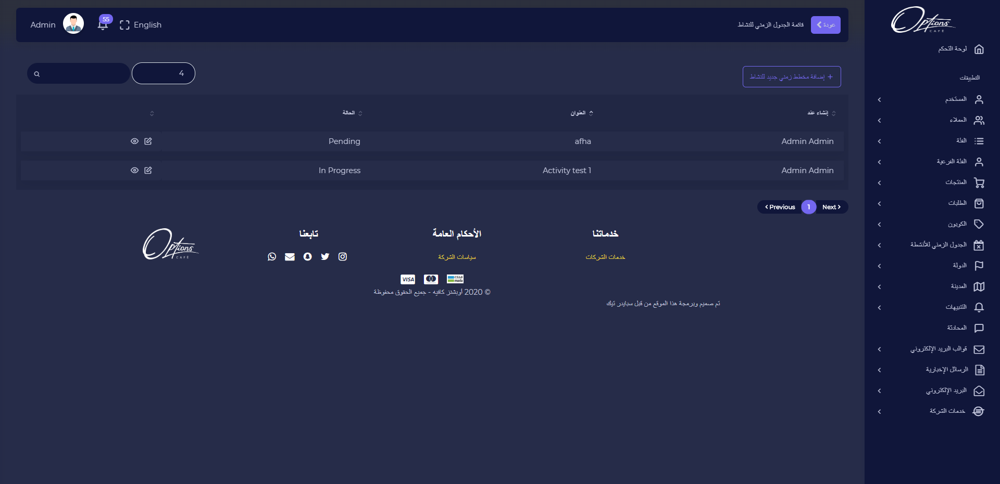
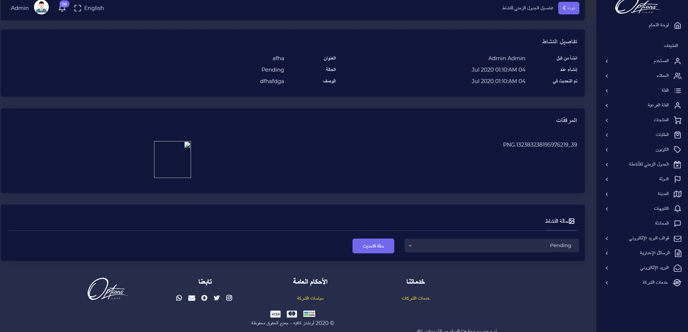
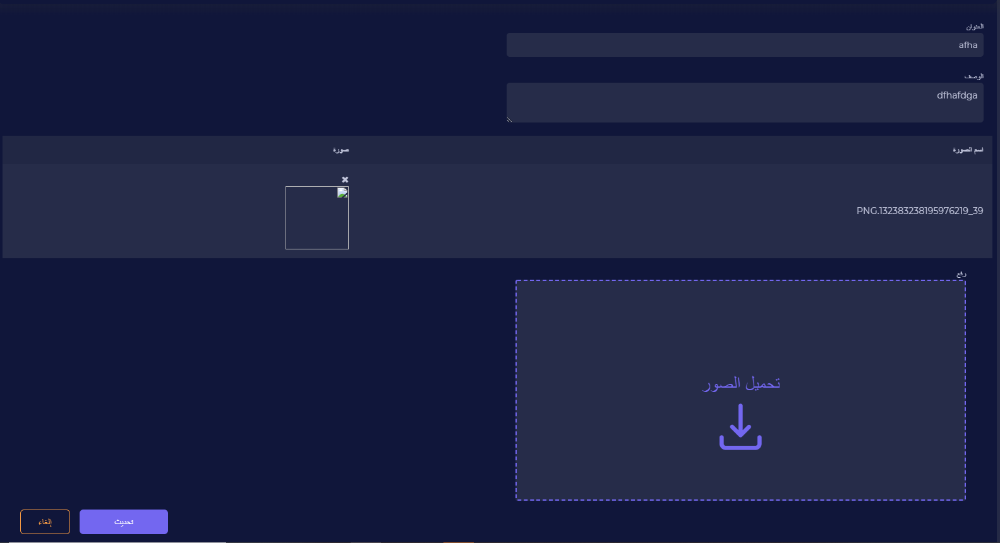

## قائمة الجداول الزمنية

قائمة الجدول الزمني يتم عرض من انشأ, عنوان وحالة الجداول الزمنية

---

### تفاصيل الجدول الزمني

عند الضغط على ايقونة التفاصيل يتم عرض تفاصيل النشاط ومرفقاته, يمكن تحديث حالة النشاط

| الوصف                      |    الحقل     |   # |
| -------------------------- | :----------: | --: |
| في انتظار بدأ النشاط       | قيد الانتظار |   1 |
| تم ايقاف التنشيط مؤقتا     |     معلق     |   2 |
|              تم اكتمال النشاط              |    اكتمل     |   3 |
| يتم اتمام النشاط  | قيد الاتمام  |   4 |

:::important
اذا تم ادخال البيانات بشكل صحيح ستظهر رسالة تفيد بذلك

:::

:::caution

اذا كان هناك قيم مفقودة مطلوبة سيتم تنبيه المستخدم بضرورة ادخالها

:::

---

## تعديل الجدول الزمنية

عند الضغط على ايقونة التعديل يمكن تحديث بيانات الجدول الزمني

| الوصف                          |         الحقل         |   # |
| ------------------------------ | :-------------------: | --: |
| يتم ادخال عنوان الجدول الزمني  |        العنوان        |   1 |
| يتم ادخال وصف للجدول الزمني    |         الوصف         |   2 |
| يتم عرض اسم الصورة وملف الصورة | اسم الصورة/ملف الصورة |   3 |
| يتم رفع صورة للجدول الزمني     |       رفع صورة        |   4 |

:::important
اذا تم ادخال البيانات بشكل صحيح ستظهر رسالة تفيد بذلك

:::

:::caution

اذا كان هناك قيم مفقودة مطلوبة سيتم تنبيه المستخدم بضرورة ادخالها

:::

---
