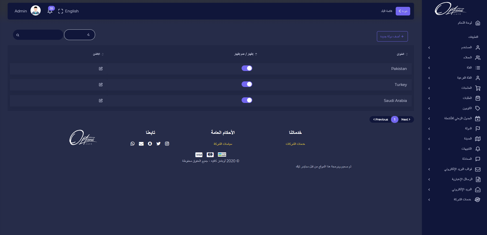
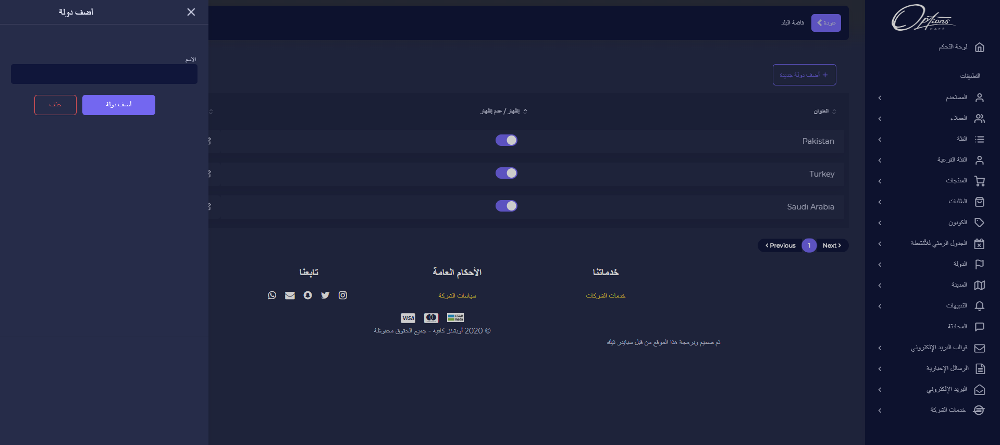

## قائمة الدول

يتم استعراض جدول ببيانات الدول وامكانية اظهار الدولة او اخفائها, كما يمكن تحرير البيانات بالضغط على ايقونة القلم

### اضافة دولة 

اضافة دولة جديدة

| الوصف                |  الحقل  |   # |
| -------------------- | :-----: | --: |
| يتم ادخال اسم الدولة | العنوان |   1 |

:::important
اذا تم ادخال البيانات بشكل صحيح ستظهر رسالة تفيد بذلك

:::

:::caution

اذا كان هناك قيم مفقودة مطلوبة سيتم تنبيه المستخدم بضرورة ادخالها

:::

---

## تعديل الدولة

عند الضغط على ايقونة التعديل يمكن تغيير عنوان الدولة

| الوصف                |  الحقل  |   # |
| -------------------- | :-----: | --: |
| يتم ادخال اسم الدولة | العنوان |   1 |

:::important
اذا تم ادخال البيانات بشكل صحيح ستظهر رسالة تفيد بذلك

:::

:::caution

اذا كان هناك قيم مفقودة مطلوبة سيتم تنبيه المستخدم بضرورة ادخالها

:::

---