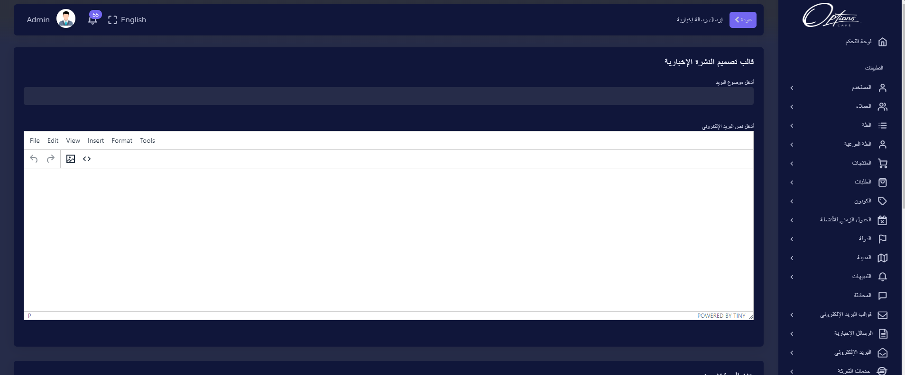

## تعبئة قالب النشرة الاخبارية

قالب تصميم النشرة الاخبارية لارسال رسائل النشرة الاخبارية للمستخدمين المشتركين او للزبائن.

| الوصف                    |    الحقل     |   # |
| ------------------------ | :----------: | --: |
| ادخل موضوع البريد المرسل | موضوع البريد |   1 |
| ادخل محتوى البريد المرسل |  نص البريد   |   2 |

:::important
اذا تم ادخال البيانات بشكل صحيح ستظهر رسالة تفيد بذلك

:::

:::caution

اذا كان هناك قيم مفقودة مطلوبة سيتم تنبيه المستخدم بضرورة ادخالها

:::

### اختر المستخدمون

يتم تحديد   من القائمة

| الوصف                    |    الحقل     |   # |
| ------------------------ | :----------: | --: |
| قم بتحديد البريد الالكتروني للمتلقي سواءً كان من مستخدمي رسالة الاخبار او من الزبائن | حدد المستخدمون |   1 |

:::important
اذا تم ادخال البيانات بشكل صحيح ستظهر رسالة تفيد بذلك

:::

:::caution

اذا كان هناك قيم مفقودة مطلوبة سيتم تنبيه المستخدم بضرورة ادخالها

:::

---