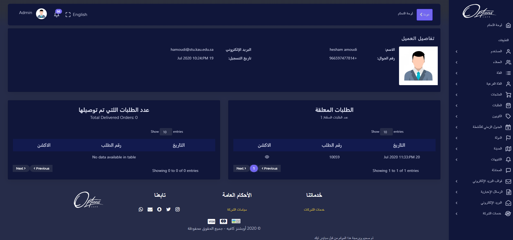
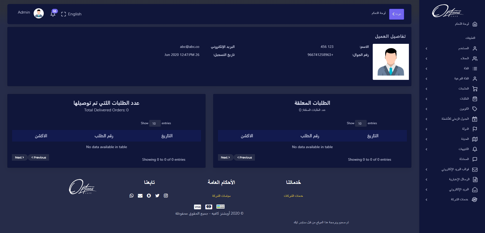
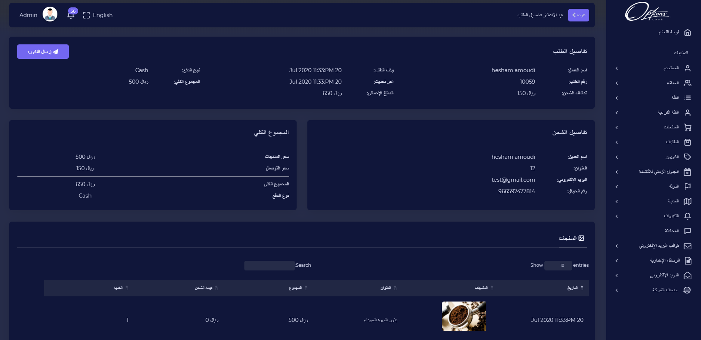

## قائمة العملاء

يتم عرض بيانات العميل تاريخ التسجيل, الصورة, الاسم, رقم الجوال, البريد الالكتروني

---

### تفاصيل العميل

## الطلبات المعلقة/عدد الطلبات اللتي تم توصيلها

الطلبات (المعلقة/اللتي تم توصيلها) :عند الضغط على ايقونة التفاصيل يتم عرض تفاصيل الطلب, تفاصيل الشحن, المجموع الكلي والمنتجات التي تم طلبها

ويمكن تحديث حالة الطلب

| الوصف                            |        الحقل        |   # |
| -------------------------------- | :-----------------: | --: |
| تم توصيل المنتج الى نقطة التوصيل |     تم التوصيل      |   1 |
| تم اعادة المنتج                  |         عاد         |   2 |
| فشل استلام الطلب من قبل العميل   |     فشل التسليم     |   3 |
| تم الغاء الطلب                   |        الغيت        |   4 |
| تم استلام الطلب من قبل العميل    |     تم الاستلام     |   5 |
| جاهز الطلب للتوصيل               |        جاهز         |   6 |
| يتم تجهيز الطلب                  |    قيد الانتظار     |   7 |
| يتم شحن الطلب                    | على استعداد السفينة |   8 |

:::important
اذا تم ادخال البيانات بشكل صحيح ستظهر رسالة تفيد بذلك

:::

:::caution

اذا كان هناك قيم مفقودة مطلوبة سيتم تنبيه المستخدم بضرورة ادخالها

:::

---
