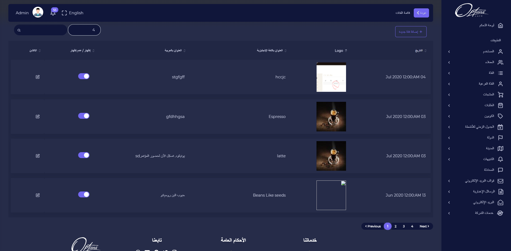
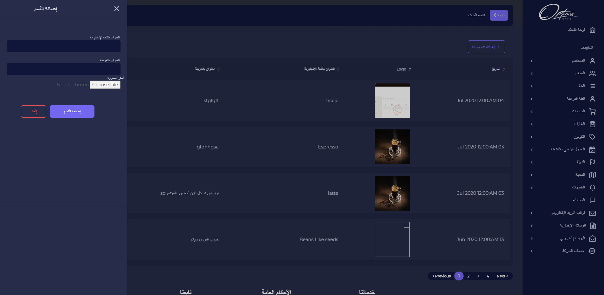

## قائمة الفئات

قائمة الفئات يتم عرض معلومات كل فئة تم اضافتها مع تاريخ الاضافة, الشعار, العنوان باللغة الانجليزية, العنوان باللغة العربية ويمكن اخفاء الفئة من المتجر

---

### اضافة فئة

اضافة فئة

| الوصف                                 |        الحقل        |   # |
| ------------------------------------- | :-----------------: | --: |
| يتم ادخال اسم الفئة باللغة الانجليزية | العنوان بالانجليزية |   1 |
| يتم ادخال اسم الفئة باللغة العربية    |  العنوان بالعربية   |   2 |
| يتم رفع صورة الفئة        |    صورة الفئة     |   3 |

:::important
اذا تم ادخال البيانات بشكل صحيح ستظهر رسالة تفيد بذلك

:::

:::caution

اذا كان هناك قيم مفقودة مطلوبة سيتم تنبيه المستخدم بضرورة ادخالها

:::

---

## تعديل فئة

عند الضغط على ايقونة التعديل يمكن تحديث بيانات الفئة

| الوصف                                 |        الحقل        |   # |
| ------------------------------------- | :-----------------: | --: |
| يتم ادخال اسم الفئة باللغة الانجليزية | العنوان بالانجليزية |   1 |
| يتم ادخال اسم الفئة باللغة العربية    |  العنوان بالعربية   |   2 |
| يتم رفع صورة الفئة        |    صورة الفئة     |   3 |

:::important
اذا تم ادخال البيانات بشكل صحيح ستظهر رسالة تفيد بذلك

:::

:::caution

اذا كان هناك قيم مفقودة مطلوبة سيتم تنبيه المستخدم بضرورة ادخالها

:::

---