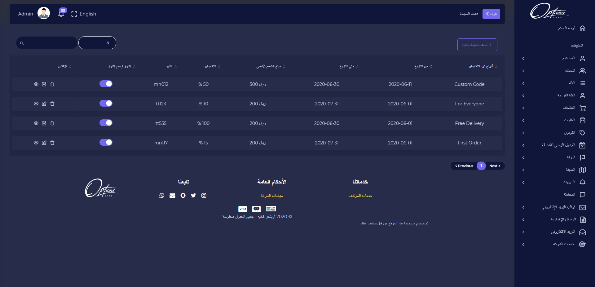

## قائمة الكوبونات

قائمة القسائم يتم عرض انواع كود التخفيض, من تاريخ, حتى تاريخ, مبلغ الخصم الاقصى, التخفيض, كود القسيمة ويمكن اخفاء القسيمة من المتجر

---

## تعديل الكوبون

عند ضغط ايقونة التعديل يمكن تحديث بيانات القسيمة وبيانات قسيمة العملاء

| الوصف                                          |          الحقل           |   # |
| ---------------------------------------------- | :----------------------: | --: |
| يتم تحديد نوع القسيمة المرسلة للعميل           |       نوع القسيمة        |   1 |
| يتم تحديد العملاء الذين سيتم ارسال القسائم لهم |       نوع القسيمة        |   2 |
| يتم تحديد تاريخ بدأ القسيمة                    |        من التاريخ        |   3 |
| يتم تحديد تاريخ انتهاء القسيمة                 |       حتى التاريخ        |   4 |
| يتم تحديد اقصى مبلغ للخصم                      |    مبلغ الخصم الاقصى     |   5 |
| يتم تحديد ادنى مبلغ للتسوق                     | الحد الادنى لمبلغ التسوق |   6 |
| يتم تحديد نسبة الخصم من مئة                    |   خصم بالنسبة المئوية    |   7 |
| يتم تحديد عدد الاكواد المرسلة للعميل           |       عدد الاكواد        |   8 |
| يتم تحديد عدد القسائم لكل عميل محدد            |      قسيمة لكل عميل      |   9 |
| يتم ادخال كود القسيمة                          |          الكود           |  10 |

:::important
اذا تم ادخال البيانات بشكل صحيح ستظهر رسالة تفيد بذلك

:::

:::caution

اذا كان هناك قيم مفقودة مطلوبة سيتم تنبيه المستخدم بضرورة ادخالها

:::

### تعديل قسيمة العملاء

عند الضغط على ايقونة التعديل يمكن تغيير العميل الذي سيم ارسال القسيمة له

| الوصف                          |    الحقل    |   # |
| ------------------------------ | :---------: | --: |
| يتم تحديد اسم العميل المرغب به | حدد العملاء |   1 |

:::important
اذا تم ادخال البيانات بشكل صحيح ستظهر رسالة تفيد بذلك

:::

:::caution

اذا كان هناك قيم مفقودة مطلوبة سيتم تنبيه المستخدم بضرورة ادخالها

:::

---
