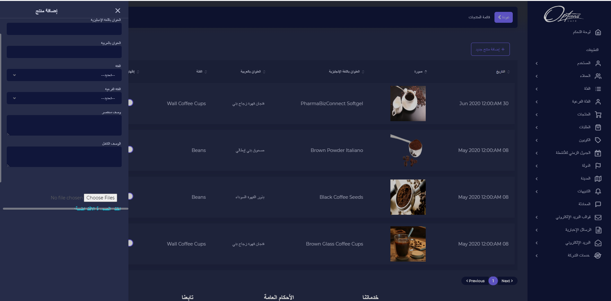

## قائمة المنتجات

ائمة المنتجات يتم عرض تاريخ اضافة, صورة,العنوان باللغة العربية, العنوان باللغة الانجليزية, الفئة الرئيسية للمنتج ويمكن اخفائه من المتجر

### اضافة منتج

اضافة منتج

| الوصف                                 |        الحقل        |   # |
| ------------------------------------- | :-----------------: | --: |
| يتم ادخال اسم الفئة باللغة الانجليزية | العنوان بالانجليزية |   1 |
| يتم ادخال اسم الفئة باللغة العربية    |  العنوان بالعربية   |   2 |
| يتم اختيار الفئة الرئيسية             |        الفئة        |   3 |
| يتم اختيار الفئة الفرعية              |    الفئة الفرعية    |   4 |
| يتم ادخال الوصف الكامل للمنتج         |      وصف كامل       |   5 |
| يتم ادخال الوصف المختصر للمنتج        |      وصف مختصر      |   6 |
| يتم رفع صورة للمنتج                   |     صورة المنتج     |   7 |

:::important
اذا تم ادخال البيانات بشكل صحيح ستظهر رسالة تفيد بذلك

:::

:::caution

اذا كان هناك قيم مفقودة مطلوبة سيتم تنبيه المستخدم بضرورة ادخالها

:::

### اضافة انواع للمنتج

عند الضغط على ايقونة الانواع يتم عرض انواع المنتج ويمكن اضافة نوع جديد للمنتج  

| الوصف                                 |        الحقل        |   # |
| ------------------------------------- | :-----------------: | --: |
| يتم ادخال اسم الفئة باللغة الانجليزية | العنوان بالانجليزية |   1 |
| يتم ادخال اسم الفئة باللغة العربية    |  العنوان بالعربية   |   2 |
|       يتم ادخال كمية المنتج       |        المخزون        |   3 |
|       يتم ادخال سعر بيع المنتج        |    سعر التجزئة     |   4 |
| يتم ادخال سعر الشراء         |         السعر الفعلي     |   5 |

:::important
اذا تم ادخال البيانات بشكل صحيح ستظهر رسالة تفيد بذلك

:::

:::caution

اذا كان هناك قيم مفقودة مطلوبة سيتم تنبيه المستخدم بضرورة ادخالها

:::

### تفاصيل المنتج

عند الضغط على ايقونة التفاصيل يتم عرض تفاصيل, وصف مختصر, وصف كامل للمنتج

---

## تعديل المنتج

عند الضغط على ايقونة التعديل يمكن تعديل بيانات المنتج

| الوصف                                 |        الحقل        |   # |
| ------------------------------------- | :-----------------: | --: |
| يتم ادخال اسم الفئة باللغة الانجليزية | العنوان بالانجليزية |   1 |
| يتم ادخال اسم الفئة باللغة العربية    |  العنوان بالعربية   |   2 |
| يتم اختيار الفئة الرئيسية             |        الفئة        |   3 |
| يتم اختيار الفئة الفرعية              |    الفئة الفرعية    |   4 |
| يتم ادخال الوصف الكامل للمنتج         |      وصف كامل       |   5 |
| يتم ادخال الوصف المختصر للمنتج        |      وصف مختصر      |   6 |
| يتم رفع صورة للمنتج                   |     صورة المنتج     |   7 |

:::important
اذا تم ادخال البيانات بشكل صحيح ستظهر رسالة تفيد بذلك

:::

:::caution

اذا كان هناك قيم مفقودة مطلوبة سيتم تنبيه المستخدم بضرورة ادخالها

:::

---
